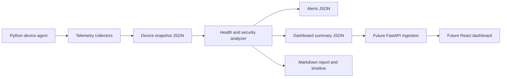

# Architecture

DeviceWatch OS is a defensive endpoint monitoring MVP for Linux devices, kiosks, signage players, and edge systems.

## Current MVP

- The local agent collects or loads one device snapshot.
- Collectors cover CPU, memory, network, process list, heartbeat, and USB telemetry.
- The analyzer detects recent reboot drift, high resource usage, suspicious process arguments, unusual outbound ports, and USB presence.
- The report builder emits safe local artifacts in `data/reports`.

## Future Product Shape

- Agent sends signed telemetry to a FastAPI ingestion service.
- API stores device snapshots, alert history, baselines, and device enrollment metadata.
- Web dashboard shows fleet health, risk score, alert timeline, and device detail views.
- Policy packs tune thresholds for kiosks, signage players, Raspberry Pi devices, and servers.
